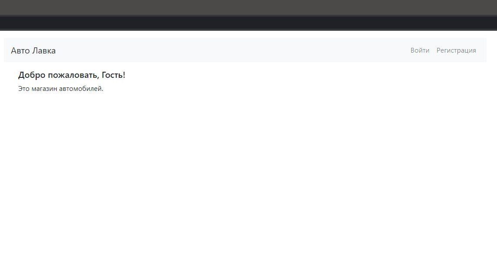
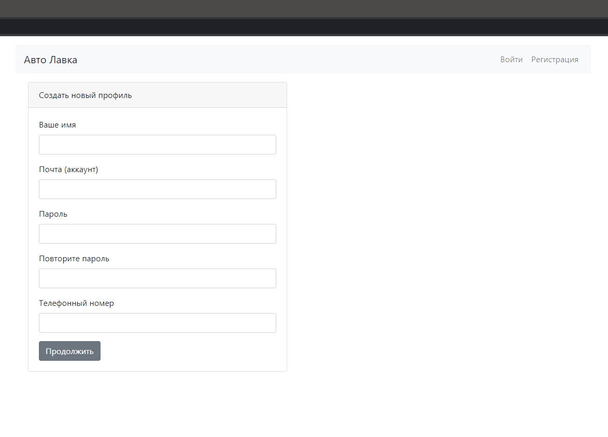
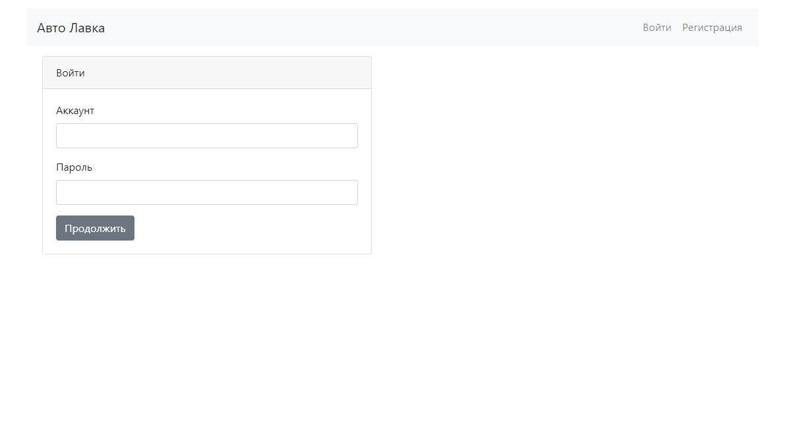
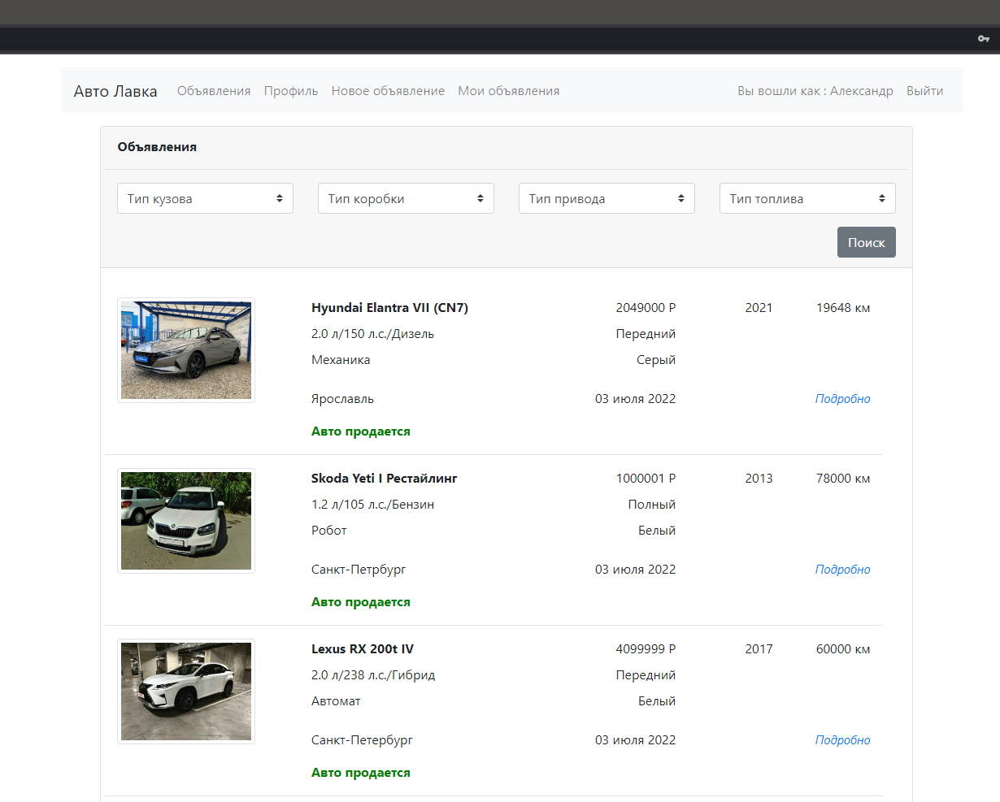
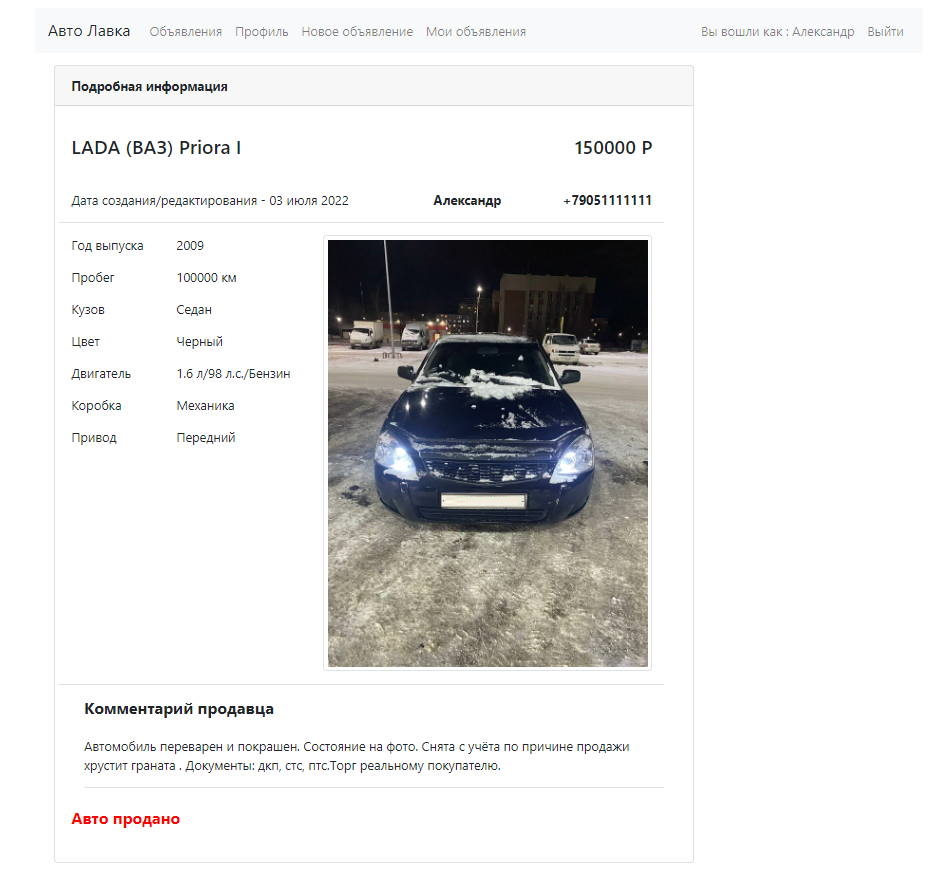
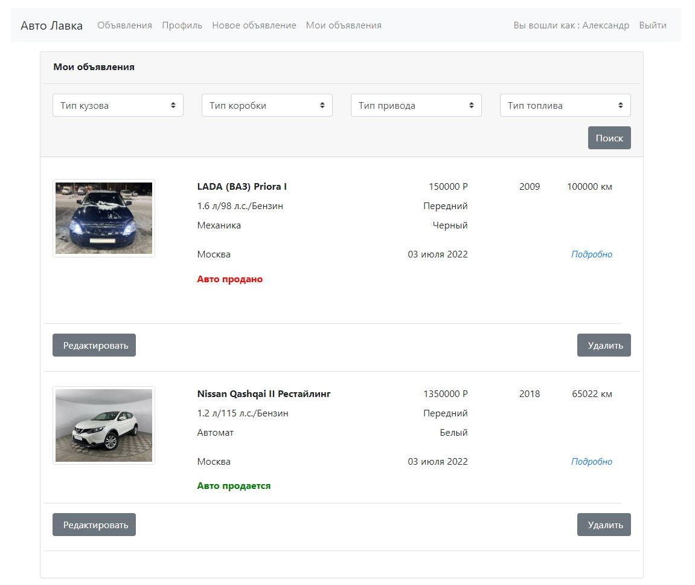
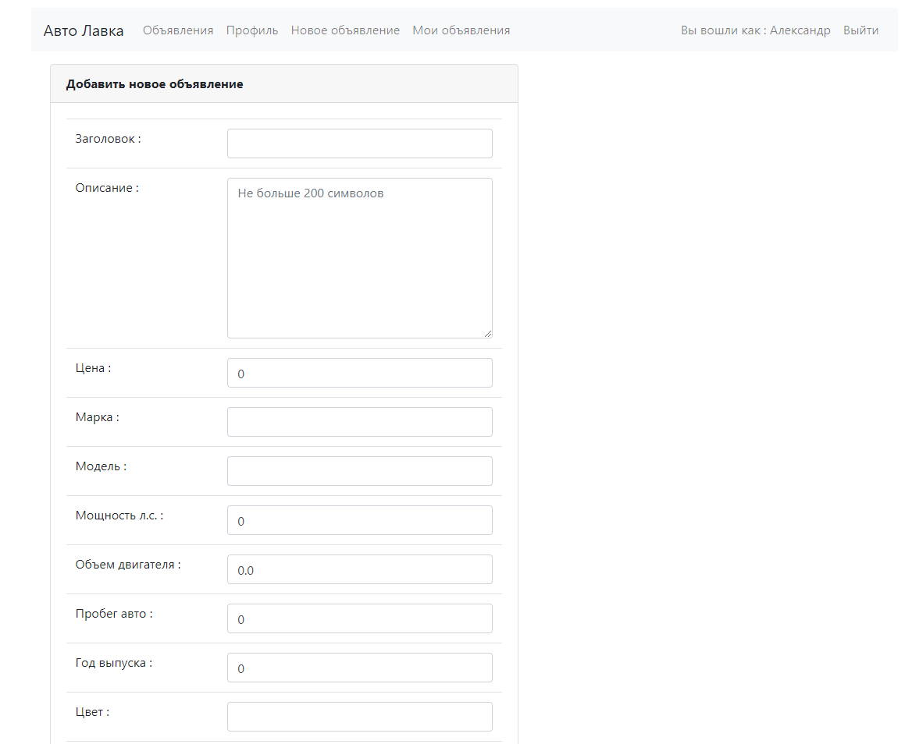
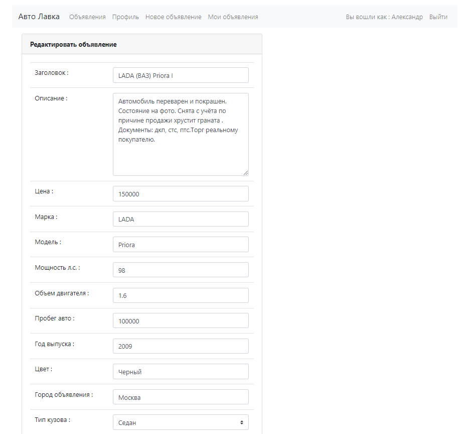

# Cars

## 
Оглавление

<ul>
<li><a href="#01">Описание проекта</a></li>
<li><a href="#02">Стек технологий</a></li>
<li><a href="#03">Требования к окружению</a></li>
<li><a href="#04">Сборка и запуск проекта</a>
    <ol type="1">
        <li><a href="#0401">Сборка проекта</a></li>
        <li><a href="#0402">Запуск проекта</a></li>
    </ol>
</li>
<li><a href="#05">Взаимодействие с приложением</a>
    <ol  type="1">
        <li><a href="#0501">Страница приветствия</a></li>
        <li><a href="#0502">Регистрация пользователя</a></li>
        <li><a href="#0503">Страница входа</a></li>
        <li><a href="#0504">Список всех объявлений</a></li>
        <li><a href="#0505">Страница объявления с подробностями</a></li>
        <li><a href="#0506">Страница "моих" объявлений</a></li>
        <li><a href="#0507">Страница создания объявления</a></li>
        <li><a href="#0508">Страница редактирования объявления</a></li>
        <li><a href="#0509">Выход из приложения</a></li>
    </ol>
</li>
<li><a href="#todo">TODO</a></li>
<li><a href="#contacts">Контакты</a></li>
</ul>

## 
Описание проекта

Веб приложение, площадка для размещения объявлений по продаже автомобилей.

Функционал:

* Регистрация пользователей, доступно редактирование профиля.
* Аутентификация и авторизация пользователей через Servlet Filter.
* Добавление, редактирование, удаление объявлений.
* Просмотр списка своих объявлений.
* Изменения статуса объявлений, перевод в категорию проданных.

<a href="#contents">К оглавлению</a>

# 
Стек технологий

- Java 14
- Spring Boot 2.6
- HTML 5,Thymeleaf, Bootstrap 4
- Hibernate 5.4
- PostgreSql 14, Liquibase
- JUnit 5
- Maven 3.8

<a href="#contents">К оглавлению</a>

Инструменты:
- Javadoc, JaCoCo, Checkstyle

<a href="#contents">К оглавлению</a>

## 
Требования к окружению

Java 14, Maven 3.8, PostgreSQL 14

<a href="#contents">К оглавлению</a>

## 
Сборка и запуск проекта

Для выполнения действий данного раздела необходимо установить 
и настроить систему сборки проектов Maven.

По умолчании проект компилируется и собирается в директорию target.  

### 
1. Сборка проекта

Команда для сборки в war
`mvn clean package -DskipTests`

<a href="#contents">К оглавлению</a>

### 
2. Запуск проекта

Перед запуском проекта необходимо создать базу данных todo
в PostgreSQL, команда для создания базы данных:
`create database carshop;`
Средство миграции Liquibase автоматически создаст структуру
базы данных и наполнит ее предустановленными данными.
Команда для запуска
`mvn spring-boot:run`

<a href="#contents">К оглавлению</a>

## 
Взаимодействие с приложением

### 
1. Страница приветствия

Со страницы приветствия пользователь может перейти к регистрации, либо к странице входа.

<a href="#contents">К оглавлению</a>

### 
2. Регистрация пользователя

Каждому пользователю присваивается пара: наименование аккаунта (email) и пароль.
Помимо имени аккаунта и пароля указываются: имя пользователя и телефон, эта контактная
информация отображаются на странице объявления.

<a href="#contents">К оглавлению</a>

### 
3. Страница входа

Для входа необходимо ввести пароль и электронную почту (наименование аккаунта), указанную при регистрации.

<a href="#contents">К оглавлению</a>

### 
4. Список всех объявлений

На странице выводится список всех объявлений пользователей сайта.

<a href="#contents">К оглавлению</a>

### 
5. Страница объявления с подробностями

На странице выводится объявление со всей доступной информацией: комментарии продавца,
контактная информация (имя, телефон).

<a href="#contents">К оглавлению</a>

### 
6. Страница "моих" объявлений

На странице выводится объявления созданных пользователем приложения.
Присутствуют кнопки редактирования и удаления объявлений.

<a href="#contents">К оглавлению</a>

### 
7. Страница создания объявления

На странице заполняется информация по продаваемому автомобилю, при 
необходимости загружается фотография.

<a href="#contents">К оглавлению</a>

### 
8. Страница редактирования объявления

На странице редактируется информация по поданному ранее объявлению.

<a href="#contents">К оглавлению</a>

### 
9. Выход из приложения

При нажатии в панели навигации на ссылку "Выход", происходит
выход пользователя из приложения с перенаправлением на страницу входа и
сообщением о том, что пользователь вышел. При выходе сессия в которой работал
пользователь удаляется.

<a href="#contents">К оглавлению</a>

## 
TODO list

* Добавить в другую ветку работу с пользователями через Spring Security

<a href="#contents">К оглавлению</a>

## 
Контакты 

&nbsp;&nbsp;
&nbsp;&nbsp;

<a href="#contents">К оглавлению</a>
